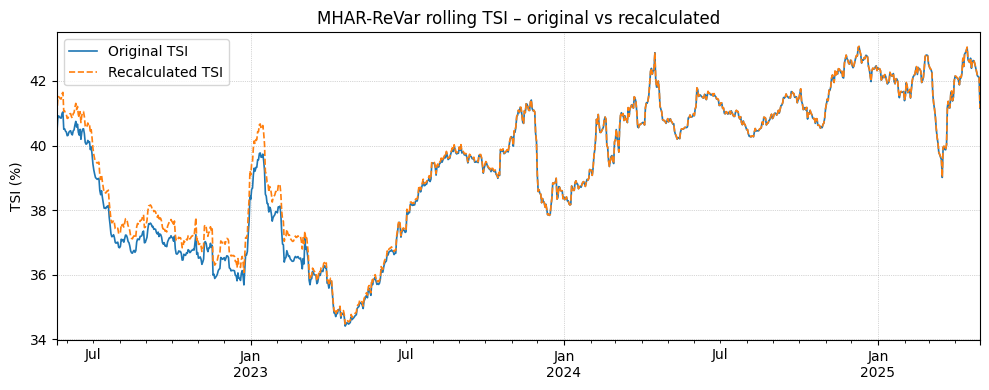
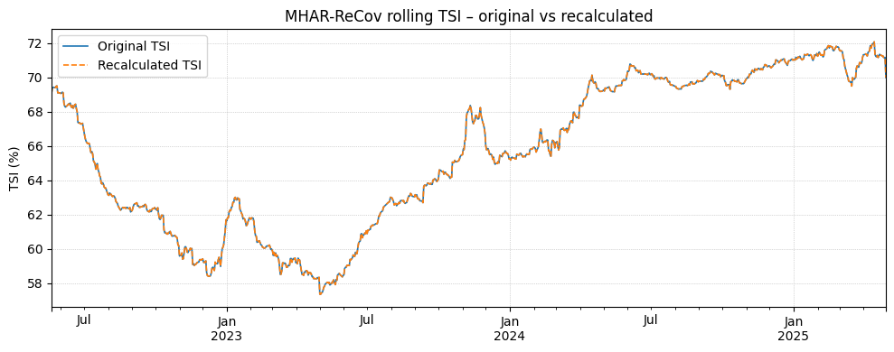
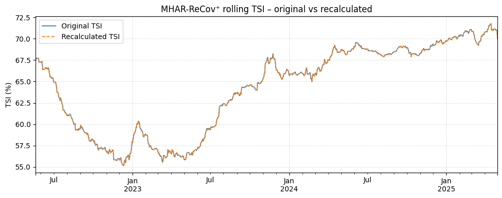
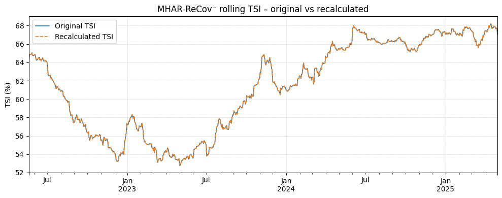

# Avances hasta el 17/12/2025

## Revisión de Cálculo de Realized Measures

Tras recalcular $ReVar, ReCov, ReCov^+, ReCov^-$, observamos consistencia entre las distintas medidas.

### Realized variances (ReVar: diagonal) – summary

| Series |         Mean |            SD |      Min |        Q1 |    Median |         Q3 |          Max |
| ------ | -----------: | ------------: | -------: | --------: | --------: | ---------: | -----------: |
| BZN|ES |  5070.049812 |   5352.802490 |  10.4895 | 1818.3048 | 3452.1524 |  6456.6980 | 5.304283e+04 |
| BZN|FR | 18392.401123 | 308355.502613 | 131.1228 | 2791.6638 | 5358.4056 | 10003.2682 | 1.169718e+07 |
| BZN|PT |  4879.048279 |   5244.339929 |   9.6059 | 1742.1937 | 3299.5098 |  6169.5043 | 5.304283e+04 |

---

### Realized (co)variances (ReCov: vars + covars) – summary

| Series        |         Mean |            SD |        Min |        Q1 |    Median |         Q3 |          Max |
| ------------- | -----------: | ------------: | ---------: | --------: | --------: | ---------: | -----------: |
| BZN|ES        |  5070.049812 |   5352.802490 |    10.4895 | 1818.3048 | 3452.1524 |  6456.6980 | 5.304283e+04 |
| BZN|FR        | 18392.401123 | 308355.502613 |   131.1228 | 2791.6638 | 5358.4056 | 10003.2682 | 1.169718e+07 |
| BZN|FR-BZN|ES |  3315.075506 |   4034.631019 | -3817.8318 | 1109.5449 | 2367.6053 |  4225.8989 | 6.044626e+04 |
| BZN|PT        |  4879.048279 |   5244.339929 |     9.6059 | 1742.1937 | 3299.5098 |  6169.5043 | 5.304283e+04 |
| BZN|PT-BZN|ES |  4803.624908 |   5196.194109 |  -665.4657 | 1713.8974 | 3273.5214 |  6066.2611 | 5.304283e+04 |
| BZN|PT-BZN|FR |  3124.346372 |   3712.517786 | -3817.8318 | 1028.2917 | 2233.8751 |  3991.9538 | 5.132851e+04 |

---

### Positive semicovariances (ReCov⁺) – summary

| Series        |        Mean |            SD |        Min |        Q1 |    Median |        Q3 |          Max |
| ------------- | ----------: | ------------: | ---------: | --------: | --------: | --------: | -----------: |
| BZN|ES        | 2884.228805 |   3160.576286 |     5.1562 |  939.5336 | 1958.9473 | 3728.5170 | 3.695749e+04 |
| BZN|FR        | 9419.748537 | 142151.494701 |    45.2133 | 1508.7405 | 2988.3389 | 5675.2000 | 5.390847e+06 |
| BZN|FR-BZN|ES | 2100.224080 |   2662.511148 | -2684.4110 |  662.2209 | 1456.4026 | 2774.5954 | 4.306259e+04 |
| BZN|PT        | 2764.199398 |   3087.079371 |     0.4871 |  891.3470 | 1862.3135 | 3585.7932 | 3.455649e+04 |
| BZN|PT-BZN|ES | 2737.004386 |   3073.006007 |  -724.2524 |  885.7239 | 1862.6833 | 3538.9309 | 3.455649e+04 |
| BZN|PT-BZN|FR | 1796.881692 |   2387.592636 | -6291.2841 |  514.6382 | 1231.0136 | 2391.0287 | 4.003416e+04 |

---

### Negative semicovariances (ReCov⁻) – summary

| Series        |        Mean |            SD |        Min |        Q1 |    Median |        Q3 |          Max |
| ------------- | ----------: | ------------: | ---------: | --------: | --------: | --------: | -----------: |
| BZN|ES        | 2185.821007 |   2432.677819 |     3.2115 |  775.1867 | 1473.1653 | 2697.6067 | 2.802685e+04 |
| BZN|FR        | 8972.652586 | 166235.249879 |    36.6541 | 1150.5414 | 2189.4653 | 4269.6456 | 6.306334e+06 |
| BZN|FR-BZN|ES | 1214.851426 |   1719.031163 | -5869.4524 |  344.2349 |  833.3905 | 1585.2847 | 2.624154e+04 |
| BZN|PT        | 2114.848881 |   2391.883632 |     3.2115 |  742.0977 | 1405.5704 | 2616.9489 | 2.802685e+04 |
| BZN|PT-BZN|ES | 2066.620522 |   2371.023200 | -1312.3094 |  723.4370 | 1384.9080 | 2524.9713 | 2.802685e+04 |
| BZN|PT-BZN|FR | 1327.464680 |   1717.429260 | -4070.6557 |  385.8252 |  917.5745 | 1701.0394 | 2.623349e+04 |

---

### Sum of ReCov⁺ and ReCov⁻ (ReCov⁺ + ReCov⁻) – summary

| Series        |         Mean |            SD |        Min |        Q1 |    Median |         Q3 |          Max |
| ------------- | -----------: | ------------: | ---------: | --------: | --------: | ---------: | -----------: |
| BZN|ES        |  5070.049812 |   5352.802490 |    10.4895 | 1818.3048 | 3452.1524 |  6456.6980 | 5.304283e+04 |
| BZN|FR        | 18392.401123 | 308355.502613 |   131.1228 | 2791.6638 | 5358.4056 | 10003.2682 | 1.169718e+07 |
| BZN|FR-BZN|ES |  3315.075506 |   4034.631019 | -3817.8318 | 1109.5449 | 2367.6053 |  4225.8989 | 6.044626e+04 |
| BZN|PT        |  4879.048279 |   5244.339929 |     9.6059 | 1742.1937 | 3299.5098 |  6169.5043 | 5.304283e+04 |
| BZN|PT-BZN|ES |  4803.624908 |   5196.194109 |  -665.4657 | 1713.8974 | 3273.5214 |  6066.2611 | 5.304283e+04 |
| BZN|PT-BZN|FR |  3124.346372 |   3712.517786 | -3817.8318 | 1028.2917 | 2233.8751 |  3991.9538 | 5.132851e+04 |

---

### Check: Max absolute difference between ReCov summary and (ReCov⁺ + ReCov⁻) summary

| Stat   | Max abs diff |
| ------ | -----------: |
| Mean   | 9.094947e-13 |
| SD     | 5.820766e-11 |
| Min    | 4.547474e-13 |
| Q1     | 2.273737e-13 |
| Median | 9.094947e-13 |
| Q3     | 3.637979e-12 |
| Max    | 1.862645e-09 |

## Revisión de Cálculo de Spillovers

En esta sección comparo el **rolling TSI** calculado originalmente vs. el recalculado.
En general, los resultados para **ReCov, ReCov⁺ y ReCov⁻** son prácticamente idénticos (diferencias del orden de 1e-4 a 1e-3).

El único caso con discrepancias relevantes es **MHAR–ReVar**, donde aparece una desviación marcada, concentrada especialmente al inicio de la muestra (primer año). 

> **TO DO:** Revisar MHAR–ReVar, ya que el TSI “original” queda más alto en el primer año.

---

### $MHAR$-ReVar rolling TSI (original vs recalculado)

- Common dates: **1077**
- Mean abs diff: **0.160649**
- Diff range: **[-0.000469, 0.895615]**
- Max abs diff: **0.895615**

**Comentario:** aquí debo revisar porqué tengo la diferencia en el primer año.

---

### $MHAR$-ReCov rolling TSI (original vs recalculated)

- Common dates: **1077**
- Mean abs diff: **0.000258**
- Diff range: **[-0.001853, 0.001998]**
- Max abs diff: **0.001998**

**Comentario:** diferencias despreciables (≈ 1e-3). Esto valida que el pipeline de ReCov (vars + covars) está consistente.

---

### $MHAR$-ReCov⁺ rolling TSI (original vs recalculated)

- Common dates: **1077**
- Mean abs diff: **0.000108**
- Diff range: **[-0.000594, 0.001186]**
- Max abs diff: **0.001186**

**Comentario:** La descomposición positiva parece bien implementada.

---

### $MHAR$-ReCov⁻ rolling TSI (original vs recalculated)

- Common dates: **1077**
- Mean abs diff: **0.000088**
- Diff range: **[-0.001822, 0.001112]**
- Max abs diff: **0.001822**

**Comentario:** también consistente. La diferencia máxima es pequeña (≈ 1e-3), compatible con redondeo o diferencias numéricas menores.

## Preparación de Variables Exógenas

Para las variables exógenas se han utilizado las siguientes fuentes

- **Coal price:** Investing. Coal (API2) CIF ARA (ARGUS-McCloskey) Futures - (MTFc1). Url: https://es.investing.com/commodities/coal-(api2)-cif-ara-futures. (Nota: Como los valores originales están en USD, para convertir a EUR hemos usado USD/EUR Historical Data (Url: https://www.investing.com/currencies/usd-eur-historical-data)).   
- **Natural gas Price (TTF):** Investing. ICE Dutch TTF Natural Gas Futures Historical Data. Url: https://www.investing.com/commodities/ice-dutch-ttf-gas-c1-futures-historical-data
- **CO2 price:** SendeCO2. EU-ETS spot. Url: https://www.sendeco2.com/es/precios-co2
* **IBEX 35 (índice bursátil – nivel en puntos):** Yahoo Finance. *IBEX 35* (**^IBEX**). Url: `https://finance.yahoo.com/quote/%5EIBEX/` (Yahoo Finanzas)
* **CAC 40 (índice bursátil – nivel en puntos):** Yahoo Finance. *CAC 40* (**^FCHI**). Url: `https://finance.yahoo.com/quote/%5EFCHI/` (Yahoo Finanzas)
* **PSI (índice bursátil de Lisboa – nivel en puntos):** Yahoo Finance. *PSI* (**PSI20.LS**). Url: `https://finance.yahoo.com/quote/PSI20.LS/` (Yahoo Finanzas)
* **Load forecast (demanda eléctrica day-ahead, MW; agregada diaria desde hourly):** ENTSO-E Transparency Platform (vía `entsoe-py`, `EntsoePandasClient.query_load_forecast`). Url: `https://transparency.entsoe.eu/` 
* **Commercial scheduled exchanges (interconexiones day-ahead, MW; agregada diaria desde hourly) — *usamos solo net flow*:** ENTSO-E Transparency Platform (vía `entsoe-py`, `EntsoePandasClient.query_scheduled_exchanges(..., dayahead=True)`). Url: `https://transparency.entsoe.eu/` 

